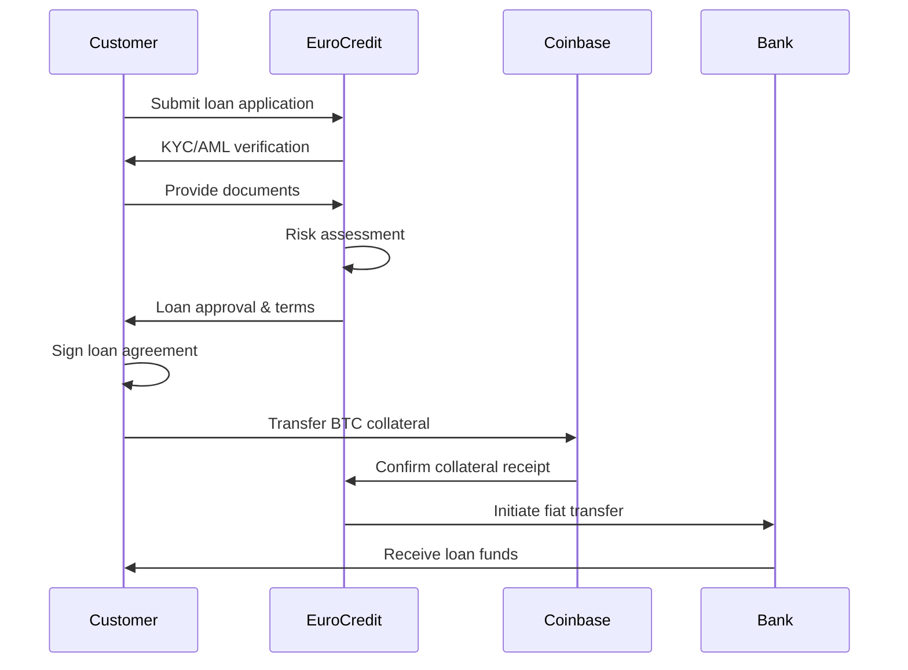
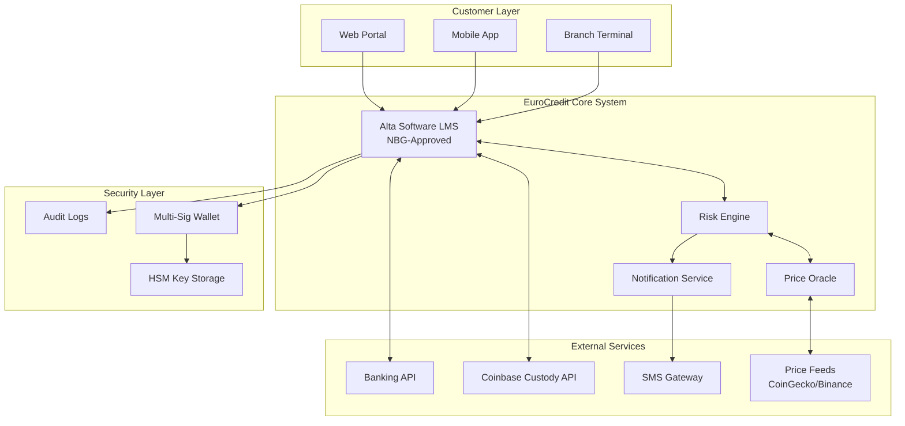

# Bitcoin-Backed Loans Implementation Proposal
## For MFO EuroCredit
### Prepared for National Bank of Georgia

---

## Executive Summary

This document outlines a framework for implementing Bitcoin-backed lending services by MFO EuroCredit, utilizing third-party custodians like Coinbase Custody for secure collateral management.

### Core Components
1. **Third-Party Custody**: Coinbase or similar institutional-grade custodian
2. **Risk Management**: Automated margin calls and liquidation protocols
3. **Regulatory Compliance**: KYC/AML adherence and NBG reporting
4. **Consumer Protection**: Multi-signature security and insurance coverage (optional)

---

## 1. Customer Journey & Engagement Process

### 1.1 Initial Customer Engagement

**Process Flow:**
• Customer Interest
• Initial Consultation
• Eligibility Check
• Product Education
• Application Decision
• KYC Process

### 1.2 Detailed Customer Journey Steps

#### Step 1: Initial Contact
- **Channels**: Website, mobile app, branch visit
- **Information Provided**: 
  - Bitcoin lending basics
  - LTV ratios available
  - Interest rates
  - Risk disclaimers

#### Step 2: Pre-Qualification
- Bitcoin holdings verification (minimum 0.1 BTC)
- Georgian residency confirmation
- Age verification (18+)
- Credit history review

#### Step 3: KYC/AML Process
- Government ID verification
- Proof of address
- Source of Bitcoin funds documentation
- Enhanced due diligence for large amounts (>1 BTC)

#### Step 4: Bitcoin Wallet Verification
- Proof of ownership demonstration
- Wallet address validation
- Transaction history review
- Digital signature verification

### 1.3 Application to Disbursement Flow

**Process Description:** The customer submits a loan application to EuroCredit, who conducts KYC/AML verification. After the customer provides required documents, EuroCredit performs risk assessment and sends loan approval with terms. The customer signs the agreement and transfers BTC collateral to Coinbase. Once Coinbase confirms receipt, EuroCredit initiates fiat transfer through the bank, and the customer receives the loan funds.



---

## 2. Loan Parameters & Risk Management

### 2.1 Loan-to-Value (LTV) Ratios

| LTV Tier | Max LTV | Interest Rate | Margin Call | Liquidation |
|----------|---------|---------------|-------------|-------------|
| **Conservative** | 50% | 8% APR | 65% | 70% |
| **Standard** | 70% | 10% APR | 80% | 85% |
| **Premium** | 80% | 12% APR | 87% | 92% |

### 2.2 Margin Call & Liquidation Process

**Process Overview:** The system continuously monitors Bitcoin prices and checks LTV ratios. When LTV exceeds warning thresholds, customers are notified and given time to add collateral or make partial repayments. If no action is taken within 48 hours and LTV reaches critical levels, liquidation is initiated. The system sells the necessary BTC amount, repays the loan, and returns any excess to the customer.


### 2.3 Margin Call Triggers

#### Warning Levels (Customer Notification Required)
- **Level 1 Warning**: LTV reaches 65% (Conservative), 80% (Standard), 87% (Premium)
  - Email & SMS notification
  - 72-hour grace period
  - Options: Add collateral or partial repayment

#### Critical Levels (Immediate Action)
- **Level 2 Critical**: LTV reaches 68% (Conservative), 83% (Standard), 90% (Premium)
  - Urgent notification via all channels
  - 48-hour grace period
  - Daily follow-up calls

#### Liquidation Triggers
- **Automatic Liquidation**: LTV reaches 70% (Conservative), 85% (Standard), 92% (Premium)
  - Immediate partial liquidation to restore 10% buffer
  - Full liquidation if buffer cannot be maintained

### 2.4 Example Scenarios

#### Scenario 1: Standard Loan
```
Initial Setup:
- BTC Price: $50,000
- Collateral: 1 BTC ($50,000)
- LTV: 70%
- Loan Amount: $35,000
- Interest: 10% APR

Price Drop Scenario:
- BTC drops to $43,750 (12.5% decrease)
- New LTV: 80% (Margin Call triggered)
- Customer must add 0.1 BTC or repay $5,000 within 72 hours
```

#### Scenario 2: Liquidation Example
```
If BTC drops to $41,176 (17.6% decrease):
- LTV reaches 85% (Liquidation trigger)
- MFO sells 0.15 BTC to restore LTV to 70%
- Customer retains 0.85 BTC in custody
- Loan amount reduced accordingly
```

---

## 3. Technical Architecture

### 3.1 System Components

**Architecture Overview:** The system consists of four main layers. The Customer Layer includes web portal, mobile app, and branch terminals. The EuroCredit Core System leverages Alta Software (already NBG-approved for EuroCredit's auto loans) as the loan management system, integrated with risk engine, price oracle, and notification services. External Services integrate with Coinbase Custody, price feeds, banking APIs, and SMS gateways. The Security Layer implements multi-signature wallets, HSM key storage, and comprehensive audit logging.



### 3.2 Alta Software Integration

**Leveraging Existing NBG-Approved Infrastructure**

EuroCredit will extend its existing Alta Software loan management system, which is already approved by the National Bank of Georgia for auto loan tracking, to handle Bitcoin-backed loans. This approach provides:

1. **Regulatory Advantage**
   - Pre-existing NBG approval and compliance
   - Established reporting mechanisms
   - Proven audit trail capabilities

2. **System Adaptations for BTC Loans**
   - Custom collateral type: "Bitcoin (BTC)"
   - Real-time LTV calculation module
   - Automated margin call workflows
   - Integration APIs for crypto price feeds

3. **Compliance Features**
   - Automated NBG reporting in existing formats
   - KYC/AML procedures already integrated
   - Risk assessment frameworks in place

### 3.3 Coinbase Custody Integration

#### API Integration Points
1. **Account Creation**
   - Customer onboarding endpoint
   - KYC document submission
   - Wallet address generation

2. **Collateral Management**
   - Deposit monitoring
   - Balance verification
   - Withdrawal authorization

3. **Security Features**
   - Multi-signature setup (2-of-3)
     - Key 1: Customer
     - Key 2: MFO
     - Key 3: Coinbase (neutral arbiter)
   - Withdrawal whitelisting
   - Time-delayed withdrawals

### 3.4 Price Oracle Architecture

**Price Feed Processing:**
• **Data Sources:**
  - Primary: Coinbase Pro
  - Secondary: Binance
  - Tertiary: CoinGecko
• **Aggregation:** Calculate median price from all feeds
• **Validation:** Feed to Risk Engine
• **Deviation Check:**
  - If >2% deviation → Alert & Manual Review
  - If <2% deviation → Use Price for calculations

---

## 4. Operational Workflows

### 4.1 Daily Operations Checklist

#### Morning (09:00)
- [ ] Review overnight price movements
- [ ] Check margin call queue
- [ ] Verify custody balances
- [ ] Review pending applications

#### Hourly
- [ ] Price feed validation
- [ ] LTV ratio calculations
- [ ] System health check
- [ ] Alert monitoring

#### End of Day (18:00)
- [ ] Daily reconciliation
- [ ] Risk report generation
- [ ] Customer communication summary
- [ ] Regulatory reporting prep

### 4.2 Margin Call Procedure

**Workflow Description:** The system continuously monitors LTV ratios. When thresholds are exceeded, it triggers warnings and notifies customers with a 72-hour response window. Customers can resolve the issue by adding collateral or repaying the loan. If no response is received, the system escalates through critical warnings (48 hours) and final notices (24 hours) before initiating liquidation and settlement procedures.


### 4.3 Customer Communication Protocol

| Event | Channel | Timing | Message Template |
|-------|---------|--------|------------------|
| **Application Approved** | Email + SMS | Immediate | Loan approved, next steps |
| **Collateral Received** | Email | Within 1 hour | Confirmation & loan disbursement timeline |
| **Price Alert (10% drop)** | Push notification | Real-time | Market update, no action needed |
| **Margin Warning** | Email + SMS + Call | Immediate | Action required, options provided |
| **Liquidation Notice** | All channels | Immediate | Liquidation executed, settlement details |

---

## 5. Regulatory Compliance Framework

### 5.1 National Bank of Georgia Requirements

#### Licensing & Registration
- MFO license modification for crypto-collateralized lending
- Custody partner registration
- Quarterly reporting obligations via Alta Software (existing NBG-approved reporting channel)

#### Consumer Protection Measures
1. **Clear Risk Disclosure**
   - Volatility warnings
   - Liquidation risk explanation
   - No deposit insurance disclaimer

2. **Cooling-Off Period**
   - 48-hour withdrawal right after agreement
   - Full refund of fees if cancelled

3. **Maximum Exposure Limits**
   - Single borrower: Max 5 BTC collateral
   - Portfolio limit: 20% of MFO's loan book

### 5.2 AML/KYC Compliance

**Compliance Flow:** Customer applications undergo risk assessment based on BTC amount. Low-risk customers (<0.5 BTC) receive standard KYC, medium-risk (0.5-2 BTC) require enhanced due diligence, and high-risk (>2 BTC) need additional source of funds verification. All customers are subject to ongoing monitoring, with suspicious activities reported to FMS and regular reviews for compliant accounts.


### 5.3 Tax Implications

| Transaction Type | Tax Treatment | Reporting Requirement |
|-----------------|---------------|----------------------|
| **Loan Disbursement** | Non-taxable event | None |
| **Interest Payments** | Deductible expense | Annual statement |
| **Collateral Liquidation** | Capital gain/loss event | Form to Revenue Service |
| **Collateral Return** | Non-taxable | Transaction record |

---

## 6. Risk Mitigation Strategy

### 6.1 Risk Matrix

| Risk Category | Probability | Impact | Mitigation Strategy |
|--------------|-------------|---------|-------------------|
| **Price Volatility** | High | High | Conservative LTV ratios, real-time monitoring |
| **Custody Failure** | Low | Critical | Insurance, multi-sig, backup custodian |
| **Regulatory Change** | Medium | High | Active engagement with NBG, flexible framework |
| **Cyber Security** | Medium | High | Cold storage, penetration testing, insurance |
| **Operational Error** | Medium | Medium | Dual approval, automated systems, training |
| **Liquidity Crisis** | Low | High | Credit lines, partial liquidation options |

### 6.2 Insurance Coverage

#### Required Policies
1. **Crime Insurance**: $5M minimum
2. **Cyber Insurance**: $10M minimum
3. **E&O Insurance**: $2M minimum
4. **Custodian Insurance**: Via Coinbase ($320M coverage)

### 6.3 Business Continuity Plan

**Continuity Strategy:** In case of primary system failure, backup systems activate immediately with customer notifications and manual processing capability, ensuring recovery within 4 hours. For custodian failures, new loans are frozen while backup custodian activation begins, with full transfer process completing within 48-72 hours.


---

## 7. Financial Modeling

### 7.1 Revenue Model

#### Income Streams
1. **Interest Income**: 8-12% APR on outstanding loans
2. **Origination Fees**: 1-2% of loan amount
3. **Late Payment Fees**: 5% of overdue amount
4. **Liquidation Fees**: 2% of liquidated amount

### 7.2 Cost Structure

| Cost Category | Monthly Estimate | Annual Projection |
|--------------|-----------------|-------------------|
| **Custodian Fees** | $5,000 | $60,000 |
| **Technology Infrastructure** | $10,000 | $120,000 |
| **Compliance & Legal** | $8,000 | $96,000 |
| **Operations Team (5 FTE)** | $15,000 | $180,000 |
| **Insurance Premiums** | $7,000 | $84,000 |
| **Marketing & Acquisition** | $10,000 | $120,000 |
| **Total Operating Costs** | $55,000 | $660,000 |

### 7.3 Break-Even Analysis

```
Assumptions:
- Average loan size: $25,000
- Average interest rate: 10% APR
- Average loan duration: 6 months
- Origination fee: 1.5%

Break-even calculation:
- Required loan volume: $15M
- Number of loans: 600
- Monthly origination: 50 loans
- Break-even timeline: Month 12
```

### 7.4 5-Year Projection

| Year | Loan Portfolio | Revenue | Operating Costs | Net Profit | ROE |
|------|---------------|---------|----------------|-----------|-----|
| **Year 1** | $15M | $1.8M | $660K | $1.14M | 18% |
| **Year 2** | $30M | $3.6M | $800K | $2.8M | 28% |
| **Year 3** | $50M | $6M | $1M | $5M | 33% |
| **Year 4** | $75M | $9M | $1.3M | $7.7M | 35% |
| **Year 5** | $100M | $12M | $1.6M | $10.4M | 37% |

---

## 8. Implementation Roadmap

### Phase 1: Foundation (Months 1-3)
- [ ] Regulatory approval from NBG
- [ ] Coinbase Custody account setup
- [ ] Core system development
- [ ] Risk management framework
- [ ] Staff training program

### Phase 2: Pilot Program (Months 4-6)
- [ ] Limited launch (50 customers)
- [ ] $1M initial portfolio
- [ ] System stress testing
- [ ] Process refinement
- [ ] Customer feedback integration

### Phase 3: Market Launch (Months 7-9)
- [ ] Public announcement
- [ ] Marketing campaign
- [ ] Branch staff deployment
- [ ] 24/7 monitoring activation
- [ ] Target: 200 customers, $5M portfolio

### Phase 4: Scale & Optimize (Months 10-12)
- [ ] Performance analysis
- [ ] Product expansion (ETH collateral)
- [ ] Automation improvements
- [ ] Partnership development
- [ ] Target: 600 customers, $15M portfolio

---

## 9. Success Metrics & KPIs

### 9.1 Operational KPIs

| Metric | Target | Measurement Frequency |
|--------|--------|----------------------|
| **Loan Origination Time** | <24 hours | Daily |
| **System Uptime** | 99.9% | Real-time |
| **Margin Call Response Rate** | >80% | Weekly |
| **Liquidation Loss Rate** | <2% | Monthly |
| **Customer Satisfaction** | >85% | Quarterly |

### 9.2 Financial KPIs

| Metric | Year 1 Target | Year 2 Target |
|--------|--------------|---------------|
| **Portfolio Size** | $15M | $30M |
| **NPL Ratio** | <5% | <3% |
| **Cost-to-Income Ratio** | 40% | 25% |
| **Return on Equity** | 18% | 28% |
| **Customer Acquisition Cost** | $200 | $150 |

---

## 10. Partnership Requirements

### 10.1 Coinbase Custody Requirements

#### Technical Integration
- API access credentials
- Webhook configuration
- Testing environment setup
- Production deployment

#### Legal Framework
- Master custody agreement
- Service level agreement (SLA)
- Insurance verification
- Dispute resolution process

#### Operational Setup
- Dedicated account manager
- 24/7 support access
- Emergency contact protocols
- Regular review meetings

### 10.2 Additional Partnerships

1. **Price Oracle Providers**
   - CoinGecko API (primary)
   - Binance API (secondary)
   - CoinMarketCap (tertiary)

2. **Insurance Providers**
   - Lloyd's of London (cyber insurance)
   - AIG (crime & E&O coverage)
   - Local Georgian insurer (general liability)

3. **Technology Partners**
   - AWS (cloud infrastructure)
   - Cloudflare (DDoS protection)
   - PagerDuty (incident management)

---

## Appendices

### Appendix A: Sample Loan Agreement

```
BITCOIN-BACKED LOAN AGREEMENT

This Agreement is entered into on [DATE] between:
- Lender: [MFO Name], registered in Georgia
- Borrower: [Customer Name], ID: [Number]

TERMS:
1. Loan Amount: [USD Amount]
2. Collateral: [BTC Amount] Bitcoin
3. Interest Rate: [X]% per annum
4. Term: [Months]
5. LTV Ratio: [X]%

MARGIN CALL PROVISIONS:
- Warning Level: [X]%
- Critical Level: [Y]%
- Liquidation Level: [Z]%

[Full legal text continues...]
```

### Appendix B: Risk Disclosure Statement

```
IMPORTANT RISK DISCLOSURE

Bitcoin-backed loans involve significant risks:

1. PRICE VOLATILITY: Bitcoin prices can fluctuate dramatically.
   Your collateral may be liquidated if prices fall.

2. NO INSURANCE: Unlike bank deposits, Bitcoin holdings 
   are not insured by any government agency.

3. TECHNICAL RISKS: Loss of private keys, hacking, or 
   technical failures could result in loss of collateral.

4. REGULATORY RISKS: Changes in law may affect your 
   ability to use or recover your Bitcoin.

By signing below, you acknowledge understanding these risks.

Signature: _________________ Date: _________________
```

### Appendix C: Technical API Documentation

```json
{
  "api_endpoints": {
    "loan_application": {
      "method": "POST",
      "url": "/api/v1/loans/apply",
      "parameters": {
        "customer_id": "string",
        "loan_amount": "number",
        "collateral_btc": "number",
        "term_months": "integer"
      }
    },
    "margin_check": {
      "method": "GET",
      "url": "/api/v1/loans/{loan_id}/margin",
      "response": {
        "current_ltv": "number",
        "warning_level": "number",
        "critical_level": "number",
        "status": "string"
      }
    }
  }
}
```

### Appendix D: Early Repayment Process

**Customer-Initiated Early Repayment**

#### Process Overview
Customers can repay their Bitcoin-backed loans early at any time without penalties. The process ensures immediate collateral release and proper settlement of all obligations.

#### Step-by-Step Process

1. **Repayment Initiation**
   - Customer logs into portal/app or visits branch
   - Requests early repayment quote
   - System calculates total amount due:
     - Outstanding principal
     - Accrued interest (pro-rated to current date)
     - No prepayment penalties

2. **Payment Execution**
   - Customer transfers funds via:
     - Bank transfer
     - Cash deposit at branch
     - Wire transfer for large amounts
   - System confirms payment receipt

3. **Collateral Release Process**
   ```
   Timeline: 2-4 hours after payment confirmation
   
   Step 1: Payment Verification (15 minutes)
   - Confirm full amount received
   - Update loan status to "Paid in Full"
   
   Step 2: Collateral Calculation (5 minutes)
   - Calculate exact BTC amount to release
   - Account for any partial liquidations
   - Generate release authorization
   
   Step 3: Multi-Signature Authorization (1-2 hours)
   - EuroCredit signs release transaction
   - Customer receives notification to co-sign
   - Transaction broadcast to Bitcoin network
   
   Step 4: Confirmation (1-2 hours)
   - Wait for 3 blockchain confirmations
   - Send final settlement statement
   - Archive loan documentation
   ```

4. **Settlement Documentation**
   - Final statement showing:
     - Total amount paid
     - Interest saved through early repayment
     - BTC returned to customer wallet
     - Transaction IDs for audit trail

#### Benefits of Early Repayment
- **No penalties**: Full flexibility to repay anytime
- **Interest savings**: Pay only for days used
- **Immediate collateral access**: BTC released within hours
- **Credit score improvement**: Positive reporting to credit bureaus

#### Example Calculation
```
Original Loan: $35,000
Term: 12 months at 10% APR
Repayment after 3 months:

Principal: $35,000
Interest (3 months): $875
Total Due: $35,875

Interest Saved: $2,625
BTC Released: Full collateral minus any liquidations
```

---

*This document is proprietary and confidential. Version 1.0 - 2024*
*Collaboration by Claude*